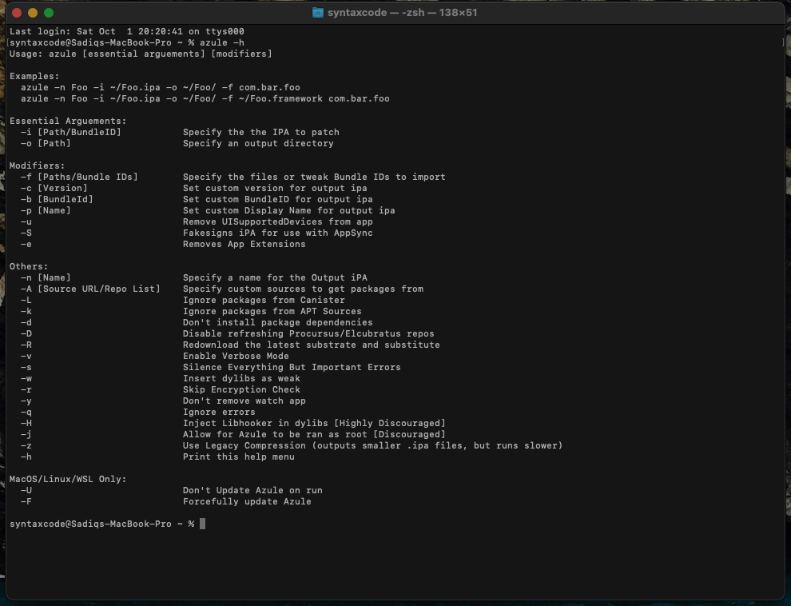
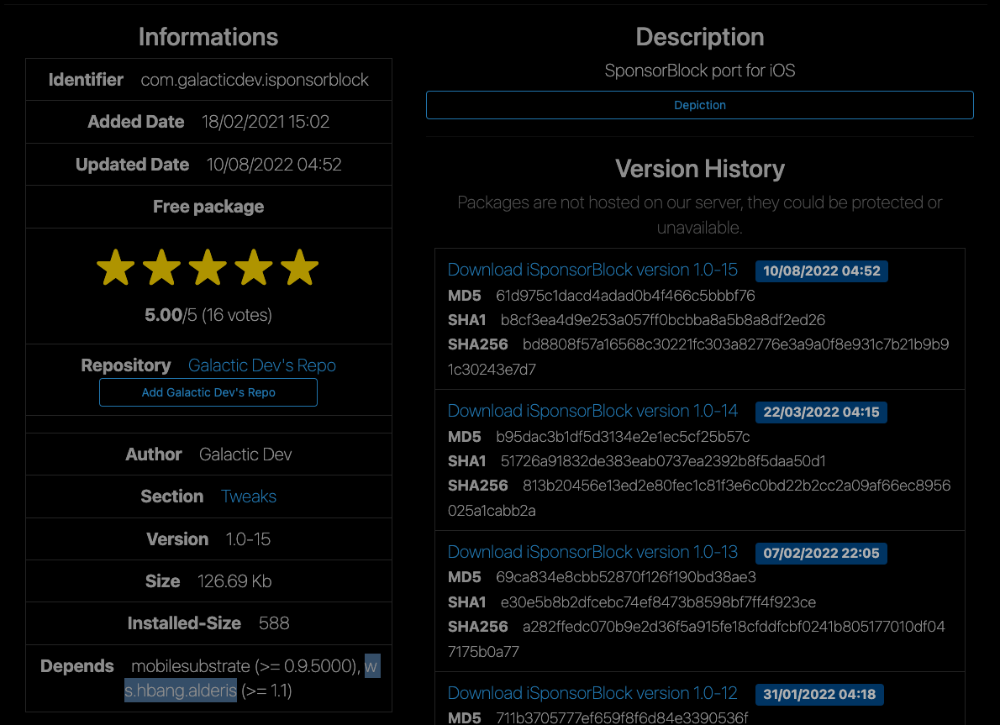
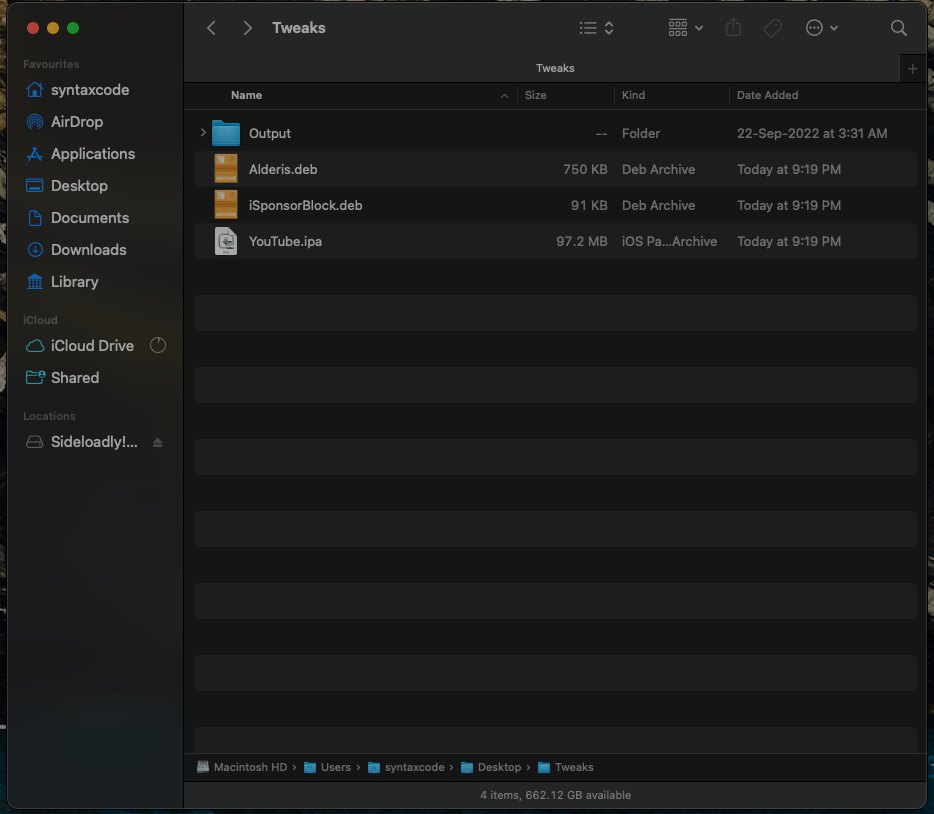
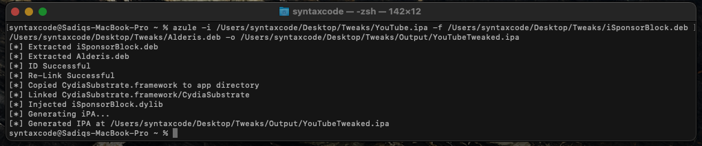
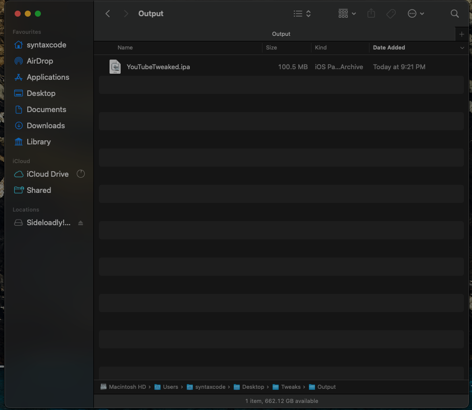

# Azule-Usage-Instructions-Desktop
Azule Tweak Injection Usage Instructions For Desktop

## Table of Contents

* [Prerequisite](#prerequisite)
* [Download & Installation](#download--installation)
* [Sideloading](#sideloading)
* [Credits](#credits)


## Prerequisite

1) MacOSX/Windows.
2) Terminal/CMD-Line (basic knowledge of how it works).
3) Azule Installed (Make sure you set azule as a global command for ease of use). 
4) Internet Connection (To download IPAs and Tweak debs).


## Download & Installation

1) Download and install azule as per their official documentation from [here](https://github.com/Al4ise/Azule/wiki).


2) Now open your terminal/cmd and type the following:

Command:
 ```sh
  azule -h
 ```
 
 
> To make sure azule is installed and running as expected. Refer to the screenshot below:





3) Now let's set an environment for our tweak injection process (optional).
Create a new directory on your desktop with your desired name (i.e Tweaks).
Within the "Tweaks" directory, create a subdirectory and name it "Output".


4) Now download your desired decrypted IPA on your computer that you wanna inject the tweaks into and move it to the newly created directory "Tweaks". For this example, we'll be using "YouTube".
You can download the IPA from anywhere, just make sure to get it from a trusted source. For this example, I'll be getting it from [AppDB](appdb.to).


5) Download the tweaks (debs/dylibs) that you wanna inject into the IPA file and move them to the "Tweaks" directory too.
You can get the deb files from anywhere, but for this example, we'll be using [ios-repo-updates.com](https://www.ios-repo-updates.com/). I prefer this site since it also mentions the dependencies of the tweaks. 


> Screenshot for reference:





6) As you can see in the screenshot, iSponsorBlock tweak depends on "ws.hbang.alderis" (version equal to or above 1.1). So search for "alderis" on the same site and download the deb too.


> We now have the IPA as well as the deb files in our "Tweaks" directory aka "The environment". 
Refer to the screenshot below to understand better.





7) Let's inject them!


> Before we do, let me explain the basic commands that we'll be using so you understand better.
- "azule" is to execute/call the script.
- "-i" is the path to import your IPA.
- "-f" is the path to your tweak that azule has to import/inject.
- "-o" is the path to export your tweak-injected IPA file.


> Now that it's clear, let's start the process, open your terminal/cmd and type the following:


Command:
 ```sh
azule -i PATH/Tweaks/YouTube.ipa -f PATH/Tweaks/iSponsorBlock.deb PATH/Tweaks/Alderis.deb -o PATH/Tweaks/Output/YouTubeTweaked.ipa
 ```
 
 
Click "enter" and azule will inject the tweaks for you in a matter of seconds.


> Please refer to the screenshot below:





DONE. Your tweaked IPA will be inside "Output" directory. 





It's that simple! ;)


> An important point to remember: When injecting a tweak that also has a dependency, be sure to inject both, the tweak deb and dependency deb in the same command so azule can adjust the path which could potentially save your app from crashing.


## Sideloading

You can sideload the Tweaked IPA using Altstore, any signing service, or TrollStore. Please search on the web on how to sideload using your preferred service.


## Credits

[Al4ise](https://github.com/Al4ise) - For creating this wonderful script [Azule](https://github.com/Al4ise/Azule).
